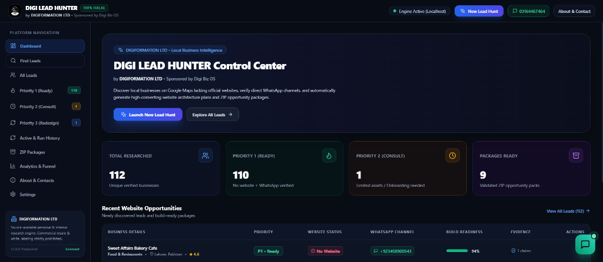

<p align="center">
  
</p>

# DIGI LEAD HUNTER
### Autonomous AI Lead Intelligence, Website Opportunity Hunter & Evidence Packaging Platform
**Official Product of DIGIFORMATION LTD • Sponsored by Digi Biz OS**

[](https://www.digibizos.co.uk/)
[](LICENSE)
[](https://www.python.org/)
[](https://vitejs.dev/)
[](https://fastapi.tiangolo.com/)

---

## 🌟 Overview

**Digi Lead Hunter** is an open-source autonomous intelligence engine developed by **DIGIFORMATION LTD**. It identifies local businesses that have active physical operations and strong customer reviews but **lack an official website** or have outdated digital presence.

### Key Capabilities:
- **Verified Business Discovery:** Live OpenStreetMap and multi-source registry lookup.
- **Strict Multi-Search Verification:** Multi-engine consensus verification before certifying "NO_WEBSITE" status.
- **Carrier Phone Validation:** Native `libphonenumber` phone carrier formatting and WhatsApp channel detection.
- **Automated Opportunity Packages:** Generates comprehensive architecture blueprints (`WEBSITE_PLAN.md`), client briefs, and 1-click ZIP deliverables.

📖 **[Read the Full Blog / Guide: How DIGI Lead Hunter Works & Business Benefits](HOW_IT_WORKS.md)**

---

## 🚀 Quickstart Guide

### 1. Installation

Clone the repository and install dependencies:

```bash
# Clone repository
git clone https://github.com/digiformationltd-creator/DIGI-LEAD-HUNTER.git
cd DIGI-LEAD-HUNTER

# Setup backend environment
python -m venv venv
venv\Scripts\activate       # On Linux/macOS: source venv/bin/activate
pip install -r backend/requirements.txt

# Setup frontend
cd frontend
npm install
npm run build
cd ..
```

### 2. Launching Control Center

Run the integrated server:
```bash
python run.py
```
Open **`http://localhost:8000`** in your browser to access the live Control Center UI and API.

### 3. CLI Quick Run

You can also run discovery directly from the terminal:
```bash
python batch_hunter.py --category "Clinics" --location "London" --count 25
```

---

## 🖥️ Control Center Dashboard

The interactive UI allows you to trigger automated discovery, inspect verified leads, check phone and WhatsApp readiness, and download client deliverables:

<p align="center">
  
</p>

---

## 📐 Pipeline Architecture

```text
User Search Request (Category + Location + Radius)
        ↓
1. Discovery Engine (Live Registry / Overpass POI)
        ↓
2. Multi-Stage Verification Engine (Multi-Search Consensus, DNS, Carrier Check)
        ↓
3. Classification Gate (P1 Build-Ready / P2 Consultation / P3 Redesign)
        ↓
4. Opportunity Packaging (Architecture Plans, Pitch Copy, ZIP Export)
        ↓
5. Control Center UI & SQLite Storage
```

---

## 📦 Deliverables in Opportunity ZIP

For each qualified lead, the engine generates:
- `WEBSITE_PLAN.md`: Information architecture, layout recommendations, and SEO strategy.
- `WEBSITE_PLAN.html`: Formatted, client-ready pitch presentation.
- `WEBSITE_BUILD_BRIEF.md`: Developer implementation blueprint.
- `EVIDENCE_REPORT.md`: Audit ledger of verification checks and timestamps.
- `MISSING_INFORMATION.md`: Onboarding questions for client consultation.

---

## 🛡️ License

Published under the **DIGIFORMATION LTD Source-Available (Personal & Internal Use) License**. Free for personal and internal business use. Commercial SaaS hosting or white-labeling is prohibited.

---

## 🏢 Official Company & Contact Directory

Lead Hunter is proudly developed and maintained by **DIGIFORMATION LTD**:

- **WhatsApp Support Hotline:** [+92 316 4467464 (03164467464)](https://wa.me/923164467464?text=Hello%20DIGIFORMATION%20LTD%2C%20I%20am%20using%20Lead%20Hunter)
- **Corporate Emails:** [info@digiformation.co.uk](mailto:info@digiformation.co.uk) • [info@digibizos.co.uk](mailto:info@digibizos.co.uk)
- **DIGIFORMATION LTD UK:** [https://www.digiformation.co.uk/](https://www.digiformation.co.uk/)
- **Digi Biz OS Ecosystem:** [https://www.digibizos.co.uk/](https://www.digibizos.co.uk/)
- **Official Linktree:** [https://linktr.ee/digiformationltd](https://linktr.ee/digiformationltd)
